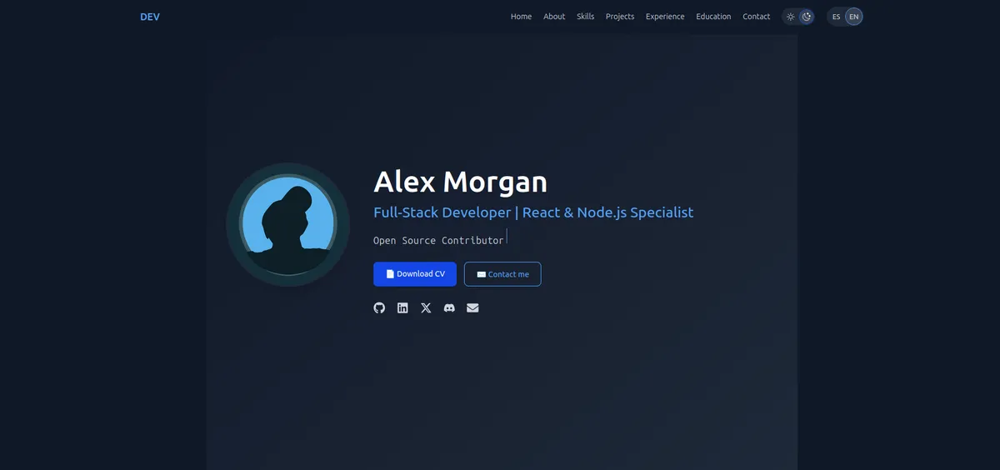

# 🚀 React Portfolio Template (Systems Engineer Edition)



A **modern, ATS-friendly, and SEO-optimized** portfolio template built with **React 19**, **Vite**, and **Tailwind CSS** — designed for **systems engineers, DevOps specialists, full-stack developers, and infrastructure architects** with deep technical experience.

✨ **Key features**:

- 🌐 **Bilingual (English / Spanish)** with auto-detection and manual toggle
- 🌓 **Dark/light mode** with persistent user preference
- 🔍 **SEO & ATS optimized**: JSON-LD, Open Graph, hreflang, semantic HTML
- 📩 **Functional contact form** with EmailJS (no backend needed)
- 🎨 **Animated sections** with Framer Motion
- 📱 **Fully responsive** and accessible (a11y-ready)
- 🖼️ **Automatic image optimization** (WebP, JPEG, PNG)
- 🚀 **One-click deploy** to Vercel, Netlify, or any static host

👉 **[Live Demo](https://react-portfolio-template.vercel.app)**

---

## 🛠️ How to Use This Template

### 1. Use this repo as a template

Click **["Use this template"](https://github.com/yakovyakov/react-portfolio-template/generate)** → **"Create a new repository"**.

### 2. Clone your new repo

```bash
git clone https://github.com/your-username/my-portfolio.git
cd my-portfolio
```

### 3. Install dependencies

```bash
npm install
```

### 4. Customize your info

Edit the files in `src/configs/` :

- `data/site.js` → your email, social links, CV URL
- `data/projects.js` → your projects
- `data/experience.js` → work history
- `data/education.js` → degrees & courses
- `lang/en.js and lang/es.js` → all visible text (titles, descriptions, etc.)

    >💡 Tip: Only edit these files — no need to touch components!

### 5. Run locally

```bash
npm run dev
```

Open <http://localhost:5173>

### 6. Build & deploy

```bash
npm run build
```

Connect your repo to [Vercel](vercel.com/new)  or [Netlify](netfly.com)  and deploy in minutes.

---

## 🖼️ Image Optimization & Build Process

This template includes **automated image optimization** to ensure fast loading and best practices:

### 🔧 Scripts included

| Script | Purpose |
|-------|--------|
| `npm run dev` | Starts dev server |
| `npm run build` | Builds production bundle |
| `npm run lint` | Runs ESLint |
| `npm run preview` | Previews production build locally |

### 📦 `prebuild` script (runs before `build`)

Before every build, the template:

1. **Optimizes all images** in `public/img/` → outputs WebP, JPEG, and PNG to `public/img/optimized/`

2. **Generates a fully SEO-optimized `index.html`** with dynamic meta tags, Open Graph, Twitter Cards, and JSON-LD

> ✅ No manual image conversion needed. Just drop your `.jpg`, `.png`, or `.webp` files in `public/img/` and run `npm run build`.

### 📁 Image workflow

```bash
# 1. Add your original image
public/img/avatar.jpg

# 2. Run build (or prebuild)
npm run build

# 3. Optimized versions are auto-generated
public/img/optimized/avatar.webp
public/img/optimized/avatar.jpg
public/img/optimized/avatar.png  # (if source is PNG)
```

> 📌 The portfolio uses WebP by default for best compression and quality.

---

## 📦 Tech Stack

| Category | Technologies |
|--------|-------------|
| **Core** | React 19, Vite 7 |
| **Styling** | Tailwind CSS 4, Framer Motion |
| **SEO / Meta** | `react-helmet-async`, JSON-LD, Open Graph, Twitter Cards, hreflang |
| **i18n** | Custom context-based translation (no heavy libraries) |
| **Form** | EmailJS (client-side only) |
| **Optimization** | Sharp (image optimization), WebP, preload |
| **Linting** | ESLint 9 (flat config), modern rules |
| **Deployment** | Vercel (recommended), Netlify, GitHub Pages |

---

## 📁 Project Structure

```tree
src/
├── configs/            # ✨ Customize here!
│   ├── data/           # site.js, projects.js, experience.js, etc.
│   └── lang/           # en.js, es.js
├── components/         # Navbar, Footer, ThemeToggle, etc.
├── sections/           # Hero, About, Skills, Projects, etc.
├── hooks/              # useTheme
├── contexts/           # TranslationContext
├── assets/             # Icons, original images
└── main.jsx            # Entry point
```

---

## 📸 Screenshots


---

## 📬 Need Help or Have Suggestions?

Open an [Issue](https://github.com/yakovyakov/react-portfolio-template/issues)!  
⭐ **Star this repo** if you find it useful!

---

## 📄 License

This project is licensed under the **MIT License** — free to use for personal, commercial, or educational purposes.

---

> ✨ **Made with passion by [Yasik Reyes Cristobal](https://yasik-dev.vercel.app)** — Systems Architect & Full-Stack Engineer
